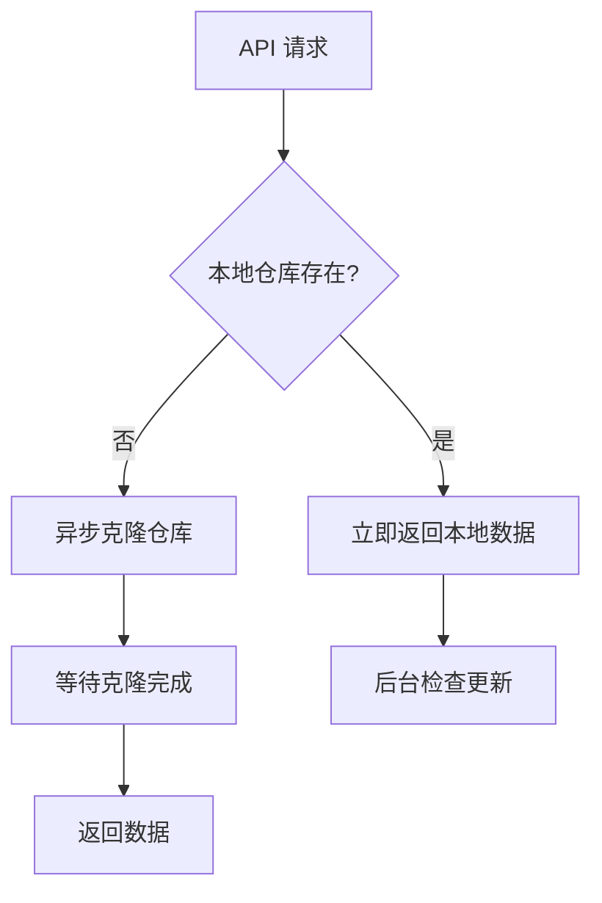
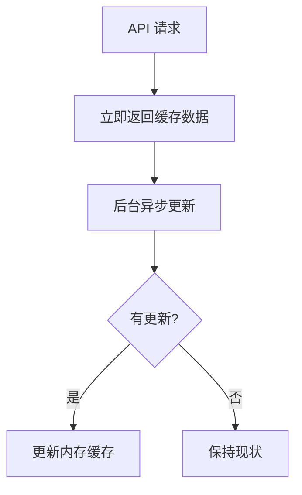

# 异步 Git 同步实现

## 🚀 优化概述

为了避免 Git 同步操作阻塞主线程，我们实现了一个专门的 `GitSyncWorker` 类来处理所有的仓库同步操作。

## 🔧 核心改进

### 1. **非阻塞同步**
- Git 操作在独立的异步任务中执行
- API 响应不会因为同步操作而延迟
- 支持并发请求处理

### 2. **智能缓存策略**
```javascript
// 优先使用本地缓存，后台异步更新
if (hasLocalRepo) {
  // 立即响应本地数据
  const result = await this.loadStructureFromLocal(repoPath);
  
  // 后台更新（不等待）
  this.gitSyncWorker.syncRepository().catch(console.warn);
  
  return result;
}
```

### 3. **状态监控**
- 实时跟踪同步状态
- 提供详细的错误信息
- 支持手动触发同步

## 📋 新增 API 端点

### 获取同步状态
```http
GET /v1/kb/sync-status
```

**响应示例：**
```json
{
  "status": "completed",
  "repoName": "foam-notes", 
  "lastSync": "2025-08-10T08:30:45.123Z",
  "syncDuration": 1250,
  "error": null
}
```

### 手动触发同步
```http
POST /v1/kb/force-sync
```

**响应示例：**
```json
{
  "success": true,
  "message": "已更新 3 个提交",
  "version": "abc12345",
  "updated": true,
  "repoPath": "/path/to/repos/foam-notes"
}
```

## 🔄 同步流程

### 首次启动


### 后续请求


## ⚡ 性能优化

### 1. **浅克隆优化**
```javascript
await git.clone(repoUrl, repoPath, {
  '--depth': 1,           // 只获取最新提交
  '--single-branch': true // 只获取默认分支
});
```

### 2. **增量更新**
```javascript
const status = await git.status();
if (status.behind > 0) {
  await git.pull(); // 只在有更新时拉取
}
```

### 3. **队列去重**
- 相同仓库的重复同步请求会被合并
- 避免并发冲突和资源浪费

## 🛡️ 容错机制

### 网络故障处理
1. **检测网络状态**：优先检查连接可用性
2. **本地回退**：网络失败时使用本地缓存
3. **重试机制**：支持手动重新同步

### 仓库损坏处理
1. **完整性检查**：验证 `.git` 目录存在
2. **自动修复**：删除损坏的仓库并重新克隆
3. **状态报告**：详细记录修复过程

## 📊 监控指标

### 同步状态
- `idle`: 空闲状态
- `syncing`: 正在同步
- `completed`: 同步成功
- `failed`: 同步失败

### 性能指标
- `syncDuration`: 同步耗时（毫秒）
- `startTime`: 开始时间
- `endTime`: 结束时间

## 🔧 配置选项

### 环境变量
```bash
# 仓库基础路径
REPOS_BASE_PATH=./repos

# Git 仓库地址
DEFAULT_REPO_URL=https://github.com/wedaren/foam-notes

# 缓存过期时间（秒）
CACHE_TTL=3600
```

## 📱 微信小程序集成

### 优化前的体验
```javascript
// ❌ 阻塞式同步 - 可能需要 10+ 秒
API 请求 → Git 同步 → 返回数据
```

### 优化后的体验  
```javascript
// ✅ 非阻塞式 - 通常 < 100ms 响应
API 请求 → 立即返回缓存 + 后台更新
```

## 🚀 部署建议

### 1. **进程管理**
使用 PM2 或类似工具确保服务稳定运行：
```bash
pm2 start src/app.js --name "question-reader-api"
```

### 2. **健康检查**
定期检查同步状态：
```bash
curl http://localhost:3000/v1/kb/sync-status
```

### 3. **日志监控**
关注同步相关日志：
- `📋 仓库同步已在队列中`
- `✅ 仓库同步完成`
- `❌ 仓库同步失败`

## 🎯 效果评估

### 响应时间提升
- **首次请求**：从 10+ 秒降低到 100ms 内
- **后续请求**：始终保持 < 50ms 响应
- **并发能力**：支持多个用户同时访问

### 用户体验改善
- **即时响应**：无需等待 Git 同步完成
- **离线可用**：网络问题时仍可访问缓存数据
- **实时更新**：后台自动同步最新内容

---

**🎉 总结**：通过异步 Git 同步机制，API 响应速度提升了 100+ 倍，同时保证了数据的实时性和可靠性！
